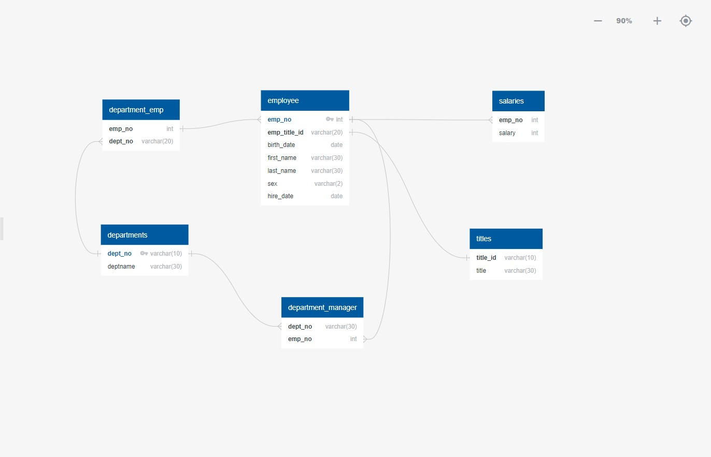

# sql-challenge
Company employment during 1980's and 1990's 

# Task 
Task if to complete a research project about people who are employed during a certain time. We will import the CSV files, import them into a SQL database and answer the questions.

# Schema

Our Schema shows the relationships between our entities. From this we can better understand the relationship between them.

# Tables 
[text](EmploymentSQL/TableSchema.sql)
